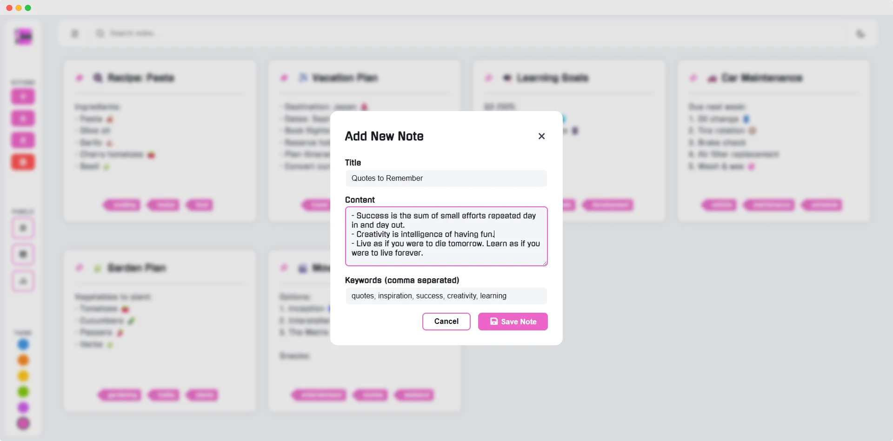
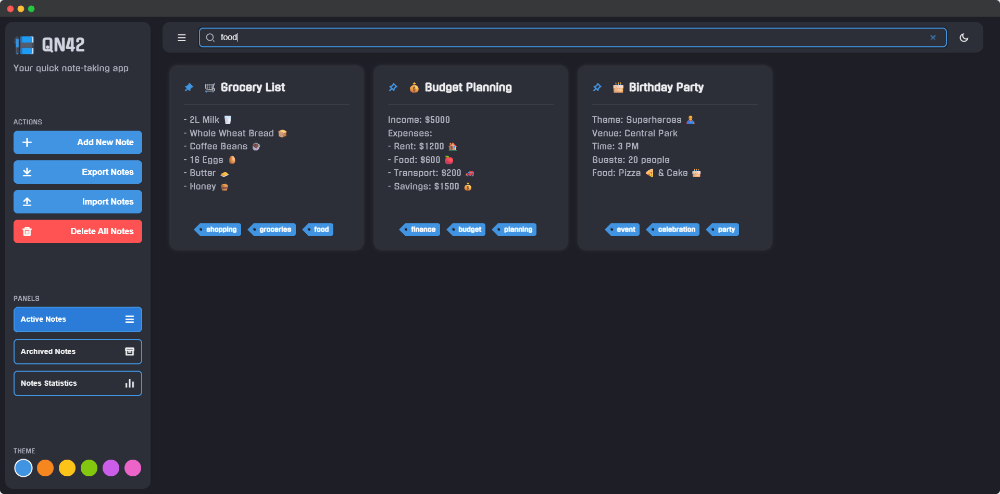
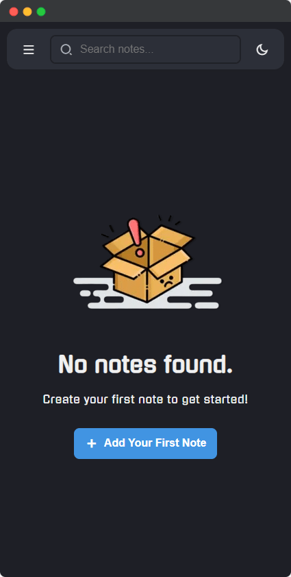
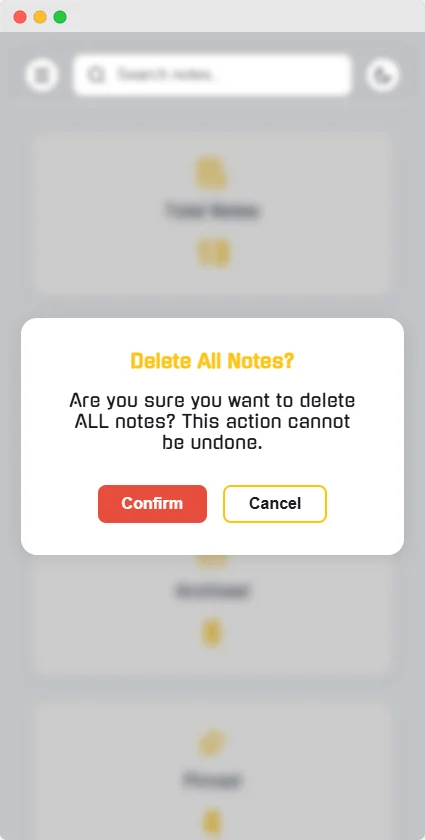
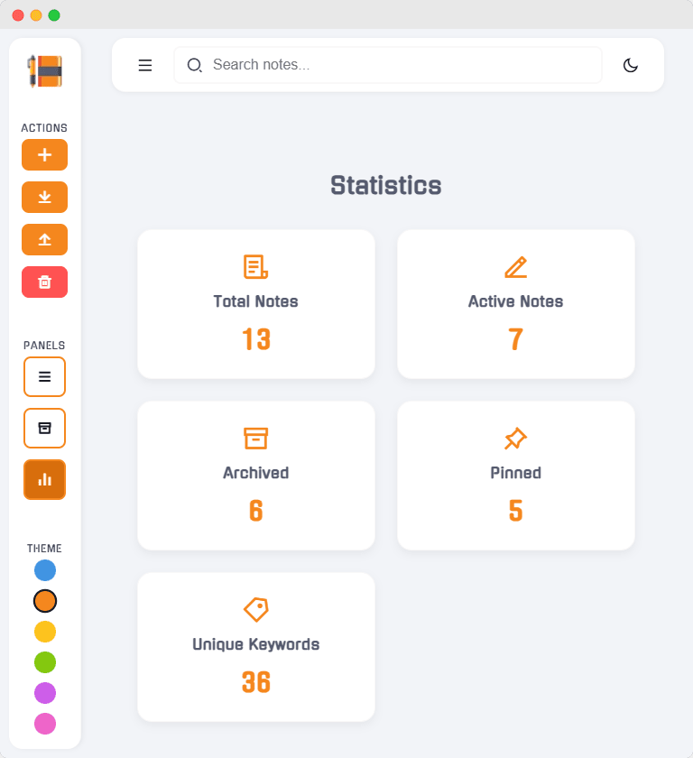
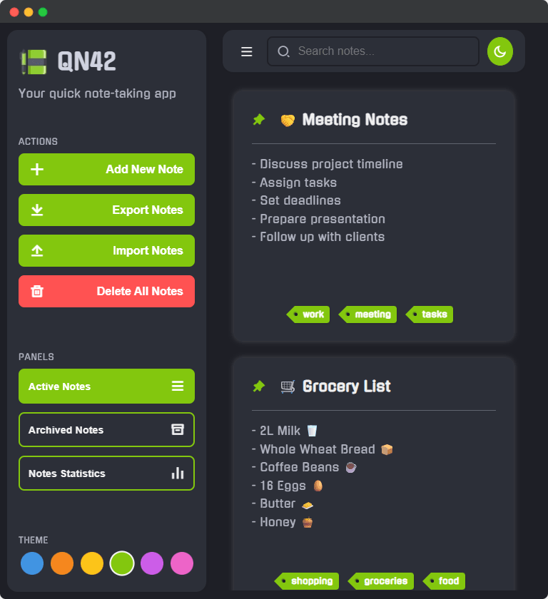
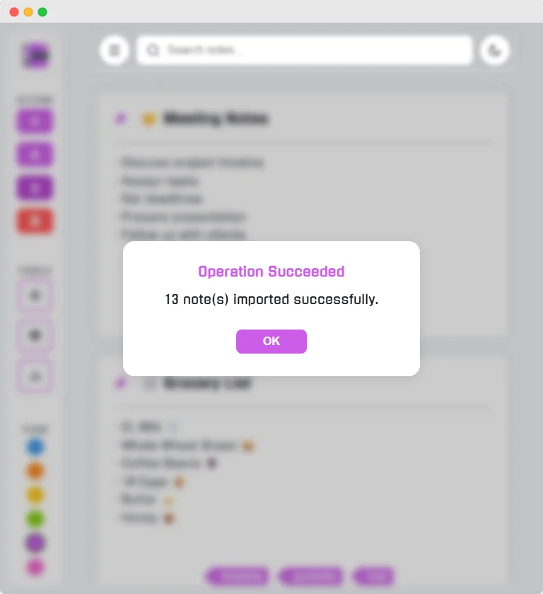

<div align="center">
  
  <h1>QNT42 - Quick Notes Taking</h1>
  <p><em>A secure, modern web-based note-taking application with end-to-end encryption</em></p>
  
  <p align="center">
     &nbsp;&nbsp;
     &nbsp;&nbsp;
     &nbsp;&nbsp;
     &nbsp;&nbsp;
     &nbsp;&nbsp;
     &nbsp;&nbsp;
     &nbsp;&nbsp;
    
  </p>
</div>

---

## 📑 Table of Contents
- [📑 Table of Contents](#-table-of-contents)
- [🚀 Overview](#-overview)
- [📸 Preview](#-preview)
  - [🖥️ Desktop View](#️-desktop-view)
  - [📱 Mobile View](#-mobile-view)
  - [📱 Tablet View](#-tablet-view)
- [✨ Key Features](#-key-features)
  - [🔐 **Security \& Privacy**](#-security--privacy)
  - [📝 **Note Management**](#-note-management)
  - [🎨 **User Experience**](#-user-experience)
  - [🔧 **Advanced Features**](#-advanced-features)
- [🛠️ Technology Stack](#️-technology-stack)
  - [**Frontend**](#frontend)
  - [**Backend \& Services**](#backend--services)
- [📁 Project Structure](#-project-structure)
- [🎯 Usage](#-usage)
- [🔒 Security Implementation](#-security-implementation)
- [🌐 Demonstration](#-demonstration)
- [🤝 Contributing](#-contributing)
  - [🚀 How to Contribute:](#-how-to-contribute)
  - [🐛 Found a Bug?](#-found-a-bug)
- [📄 License](#-license)
- [👨‍💻 Author](#-author)
- [🌟 Future Enhancements](#-future-enhancements)

---

## 🚀 Overview

**QNT42** (Quick Notes Taking) is a lightweight, secure, and efficient note-taking web application designed for fast and easy note management. With a clean and intuitive interface, it lets you write, store, and manage notes securely with complete privacy - your data is encrypted and accessible only to you.

---

## 📸 Preview

<div align="center">

### 🖥️ Desktop View  

<br>
<br>
  

### 📱 Mobile View  
&nbsp;
&nbsp;


### 📱 Tablet View  
&nbsp;
&nbsp;


</div>

---

## ✨ Key Features

### 🔐 **Security & Privacy**
- **End-to-end encryption** for all notes and metadata
- **Client-side encryption** before data storage
- Secure authentication with email verification
- Password reset and account recovery systems

### 📝 **Note Management**
- Create, edit, and organize notes with titles and content
- Keyword tagging system for easy organization
- Advanced search functionality
- Note pinning and archiving capabilities
- Import/export functionality with JSON support

### 🎨 **User Experience**
- Responsive design optimized for all devices
- Multiple color themes with light/dark mode support
- Intuitive drag-and-drop interface
- Customizable note cards and layouts
- Smooth animations and transitions

### 🔧 **Advanced Features**
- Real-time note synchronization
- Note statistics and insights
- Data portability with backup options
- Cross-device compatibility
- OTP-based account verification

---

## 🛠️ Technology Stack

### **Frontend**
- **HTML5** - Semantic markup and structure
- **CSS3** - Modern styling with Flexbox, Grid, and CSS Variables
- **Vanilla JavaScript (ES6+)** - Clean, dependency-free functionality
- **Font Awesome 6.4.0** - Professional icon library
- **Lucide Icons** - Modern icon set

### **Backend & Services**
- **Firebase Authentication** - Secure user management
- **Firebase Realtime Database** - Real-time data synchronization
- **EmailJS** - Transactional email service for notifications
- **Web Crypto API** - Client-side encryption implementation

---

## 📁 Project Structure
```
   QNT42/
      ├── index.html # Landing/Home page
      ├── readme.md # Project documentation
      ├── license.md # License information
      └── src/
         ├── assets/
         │   ├── css/
         │   │   ├── home.css # Landing page styling
         │   │   ├── forms.css # Authentication forms styling
         │   │   ├── notifier.css # Notification system styling
         │   │   ├── faq.css # FAQ page styling
         │   │   └── policies.css # Policy pages styling
         │   ├── images/
         │   │   ├── logo/ # Brand logos and favicons
         │   │   ├── .preview/ # Image previews of the platform
         │   │   └── illustrations/ # App illustrations
         │   └── js/
         │      ├── config.js # Firebase and service configurations
         │      ├── utils.js # Utility functions and helpers
         │      ├── auth-guard.js # Authentication routing system
         │      ├── home.js # Landing page functionality
         │      ├── notifier.js # Notification system
         │      ├── mailer.js # Email service integration
         │      ├── notes.js # Note management functionality
         │      └── formSwitcher.js # UI form switching logic
         ├── pages/
         │  ├── auth/
         │  │  ├── authenticate.html # Login/Registration page
         │  │  ├── recover.html # Password recovery
         │  │  └── secure.html # Account verification
         │  ├── policies/
         │  │  ├── faq.html # Frequently asked questions
         │  │  ├── privacyPolicy.html # Privacy policy
         │  │  └── termsOfService.html # Terms of service
         │  └── dashboard.html # Main application interface
         └── services/
            ├── login.js # Login authentication service
            ├── register.js # Registration service
            ├── oauth.js # OAuth integration
            ├── forgot.js # Password recovery service
            ├── recover.js # OTP recovery service
            ├── reset.js # Password reset service
            └── verify.js # Account verification service
```


---

## 🎯 Usage

QNT42 is designed for personal and educational use:

1. **Account Creation**: Register with email and secure password
2. **Email Verification**: Verify your account with OTP sent to your email
3. **Note Creation**: Start creating encrypted notes with titles and keywords
4. **Organization**: Use keywords to categorize and search your notes
5. **Data Management**: Export your notes for backup or import existing notes

---

## 🔒 Security Implementation

- All note content is encrypted using AES-GCM encryption before storage
- Encryption keys are generated per user and never leave the client
- Firebase authentication secures user accounts
- Session management with automatic logout after inactivity
- No plaintext note data is stored on any server

---

## 🌐 Demonstration

This is the live demo of [QNT42](https://edunwant42.github.io/qnt42/)

---

## 🤝 Contributing

Contributions to **QNT42** are very welcome! 🎉  
If you'd like to help improve the project, please fork the repository and submit a pull request. Feel free to open issues for bugs or feature requests.

### 🚀 How to Contribute:
- 🍴 Fork the repository
- ⭐ Create a feature branch
- 💻 Make your changes
- ✅ Test your changes
- 📤 Submit a pull request

### 🐛 Found a Bug?
- 🔍 Check if it's already reported in issues
- 📝 Create a detailed bug report
- 🏷️ Use appropriate labels

---

## 📄 License

This project is licensed under a **Personal & Educational Use License**, see the [LICENSE](license.md) file for details.

**Summary:** Free for personal, educational, and non-commercial use. Commercial use requires explicit permission.

---

## 👨‍💻 Author

**Abderrahmane Abdelouafi**
- Portfolio: [https://ed42.tech](https://ed42.tech)
- Main GitHub Account: [@ababddelo](https://github.com/ababddelo)

---

## 🌟 Future Enhancements

While QNT42 is currently a frontend-only application, future plans include:

- Custom backend implementation for enhanced control
- Advanced collaboration features
- Mobile application development
- Browser extension for quick note capture
- Advanced note organization with folders and tags
- Rich text editing capabilities
- Note sharing with permission controls

---

<div align="center">
  <p><strong>Built with passion for learning and sharing knowledge</strong></p>
  <p><em>2025 - QNT42: Where Your Thoughts Stay Private</em></p>
</div>
